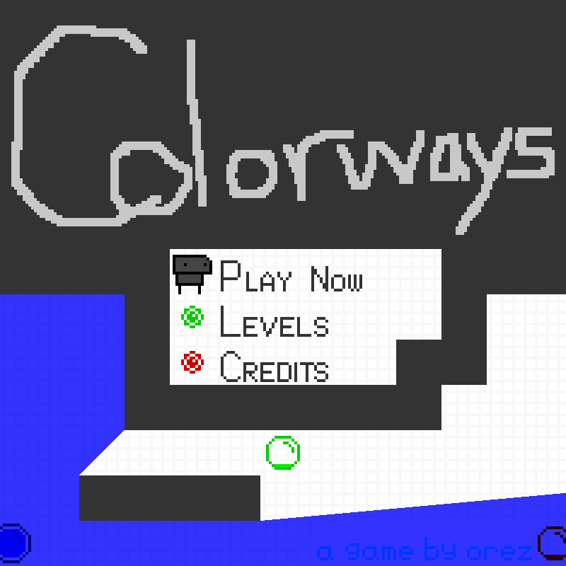

# This branch is specifically for OSX users affected by the `cargo:warning=clipper/wrapper.cpp:21:34: error: a space is required between consecutive right angle brackets (use '> >')` compilation bug.

# Colorways

A Sokoban-ish puzzle game where things are exactly as they seem

My entry for Ludum Dare 49 - Unstable



## Controls
- WASD / Arrow keys to move
- Z / Space to accept
- Backspace to return to level select

## Windows + Mac
Executables and instructions for running can be found [here](https://github.com/orez-/ld49/releases/tag/ld49-submission)

## Running from Source
- Make sure [Rust 1.55+](https://www.rust-lang.org/tools/install) is installed
- Download the source and run `cargo run --release`

### OSX
- If you get an error message about being unable to link `-lSDL2`, try installing SDL:

```bash
brew install SDL2
```

## Special Thanks
- Thanks to [@zellio](https://github.com/zellio) for packaging the executables
- Thanks to Doug Beck, Frank Zegarra, Zachary Elliott, and Benoit Hiller for playtesting
